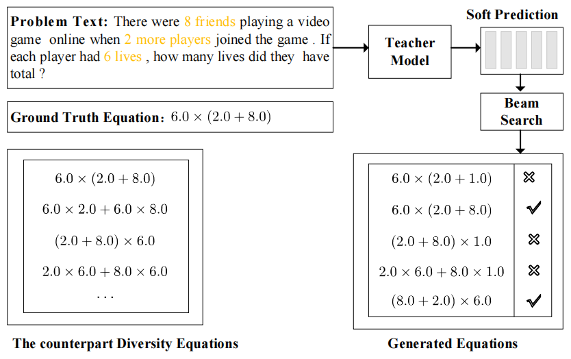

## A Diversity-Enhanced Knowledge Distillation Model for Practical Math Word Problem Solving

This is the offcial repo for the paper "[A Diversity-Enhanced Knowledge Distillation Model for Practical Math Word Problem Solving]".

<div align="center">
  
</div>

It is worth noting that our article is still in the review stage. 
In order to protect our intellectual property, we do not provide a nanny introduction of code implementation, 
only the trained model and core code.
Of course, by reading the implementation details of our codes in the project, you can see how our approach is implemented.

### Requirements
* Python = 3.8.xx;
* Pytorch = 1.11.0+cu113 ;
* You can see the `requirements.txt` in each dictionary, run `pip install -r requirements.txt` to get environment ready.

### Datasets and Models


We provide the data and the already trained model in cyberspace to make it easy for the reader to reproduce my results. 
Our repository includes the following datasets:

- [Datasets](https://pan.baidu.com/s/1sKSeYZfN_Qy8TKv7O4lSTQ?pwd=5ape) ---> password: 5ape

- [Models](https://pan.baidu.com/s/1GOMd7jcm-G-eiYko2LCwkA?pwd=qqrq) ---> password: qqrq


You should unzip it into the project directory according to the corresponding folder name in the above downloaded file.


### Usage

If you want to reproduce our model from scratch yourself, we also provide a rough implementation path.

#### Getting started
For example, reproduce the results of ``Ro-Graph2Tree + DivKD '' for `MathQA` dataset with train/val/test setting,

1. Download pre-trained language models to local hard disk or use the pre-trained language models in your codes.

2. Pre-train the teacher model and dump it.
```shell
bash run_Ro_graph2tree.sh
```

3. Train the student model and dump it.
```shell
bash run_Ro_graph2tree_both_kd.sh
```


### Main Results
We reproduce the main results of **LLaMA-Graph2Tree-Z + DivKD** in the following table.

| Dataset                 | Value Accuracy | 
|:------------------------|:--------------:|
| Math23k (5-fold CV)     |      85.6      | 
| Math23k (train/test)    |      86.7      |
| MAWPS (5-fold CV)       |      92.8      | 
| MathQA (train/val/test) |      79.3      |


### Citation

Waiting for the results of the review.